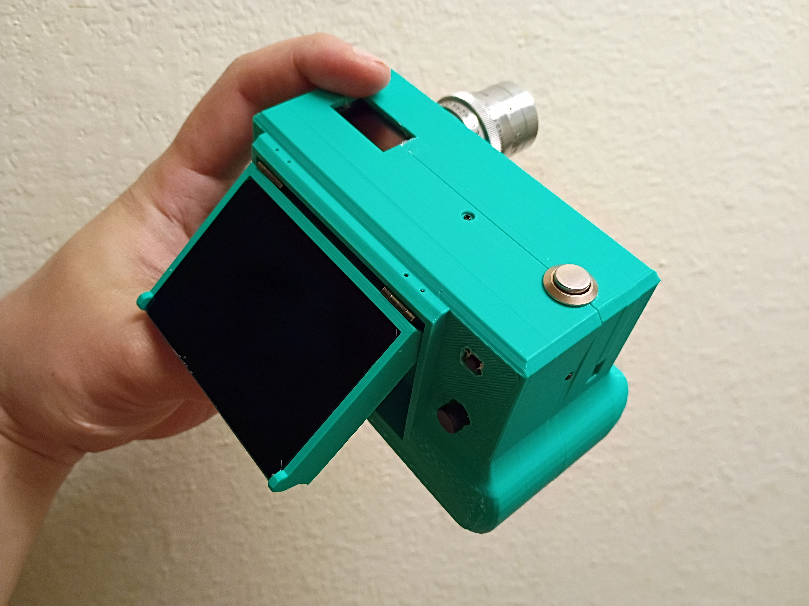
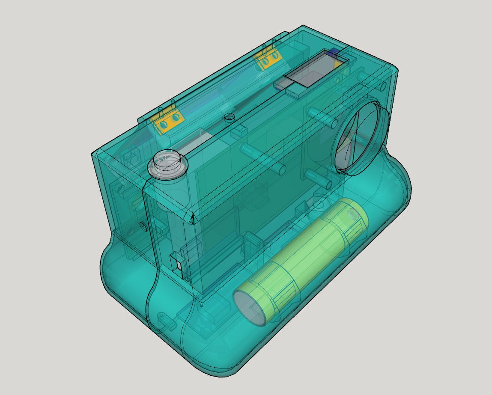

### A custom camera body based on Raspberry Pi ecosystem

#### Features

- 2.8" DSI touchscreen display
- 0.91" OLED
- 10-axis IMU
- 7 physical button interface
- full sized Raspberry Pi 4B
- powered by single 18650 cell

### Software

This uses [Pelicam](https://github.com/jdc-cunningham/pelicam) which is in development. The original software is [here](https://github.com/jdc-cunningham/modular-pi-cam/tree/master/cameras/pi-zero/large-display/software). But that was written for SPI displays.

### Media

For development videos and sample photos see my hardware YouTube channel [Vanta Wing](https://www.youtube.com/watch?v=lcudzqBnKbo&list=PL60azPuS5CZjkKGVGffiGK8XfBCXdif9R)

### About the name
The name is my name but also it's 3 c's (including the word camera) and the camera number. Yeah I do have other camera bodies I want to design and make. One would be based on the ESP32 ecosystem, means lower resolution but yeah.

I haven't thought of an actual name for this camera so... I figure I'd just use numbers.
