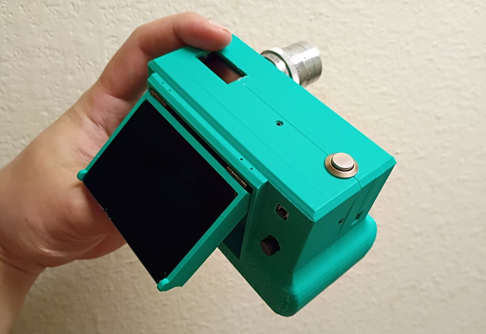
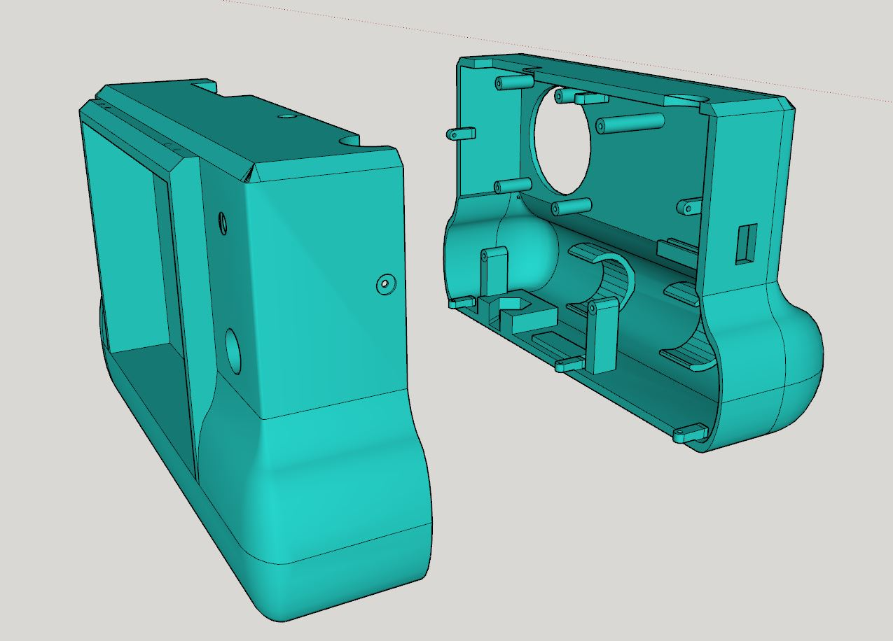
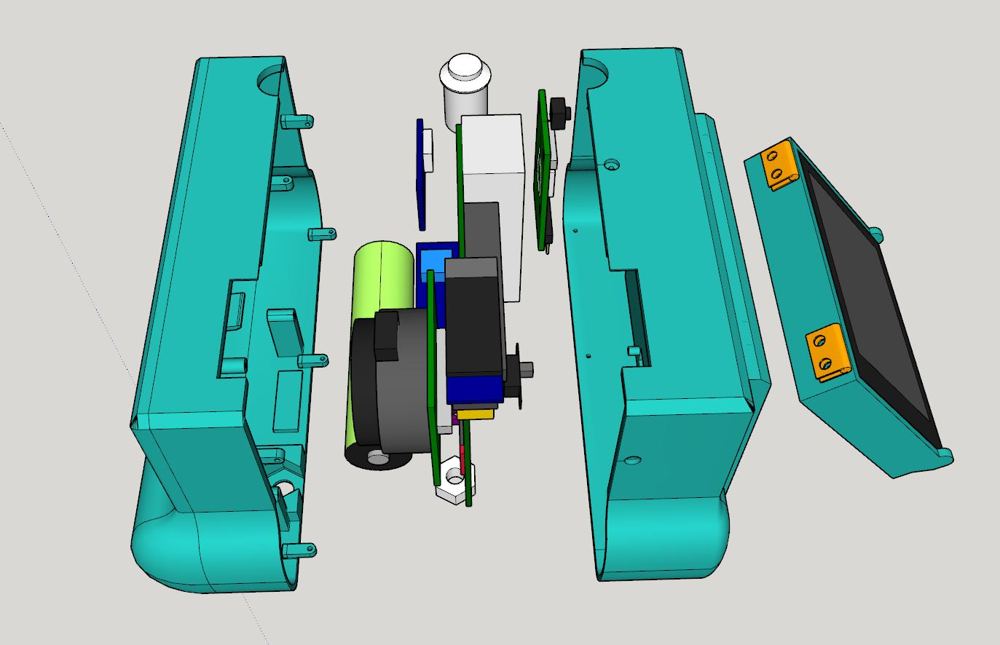

### Disclaimer

Please note: the front shell needs some corrections, I'll remove this message once I have made the changes. In general this mesh is messed up, I did the modeling in SketchUp and it has problems with solids. Refer to design flaws file.

#### Note about the lens mount

I did not realize that the [flat plate](http://forums.raspberrypi.com/download/file.php?id=75978) part of the lens mount can be adjusted (flat screw) and then there is the CS adapter itself that can be moved. In this camera I designed the flat plate to be flush against the camera body. Ideally that would be able to rise below/above the front part of the camera, I need to adjust the design for that.

### Print times at 20% infill

- Display caddy - 2hrs
- Back shell - 11 hrs
- Front shell - 13.5 hrs

### Design flaws

I've written this on [another page](./design-flaws.md)
