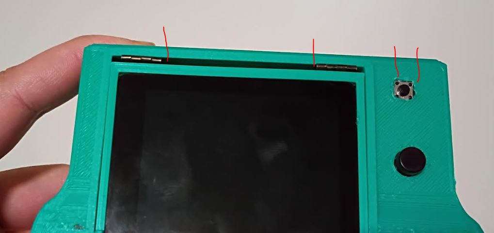
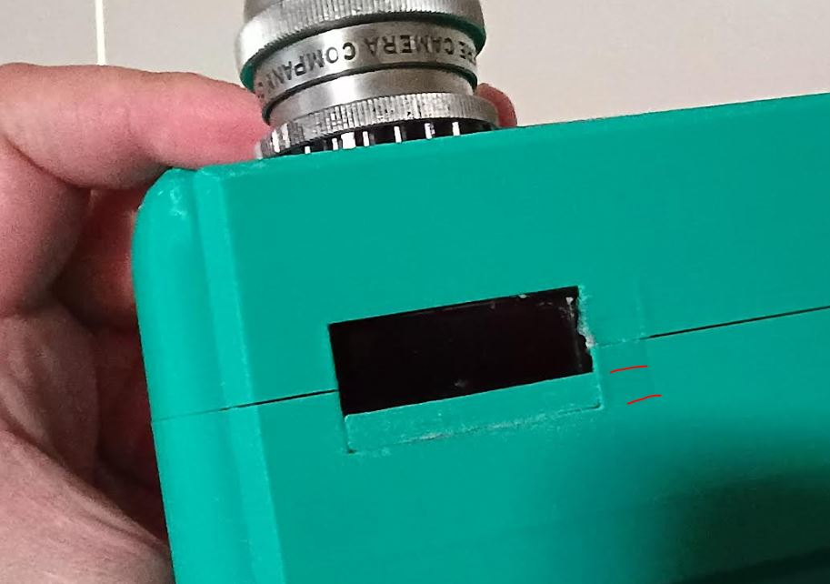
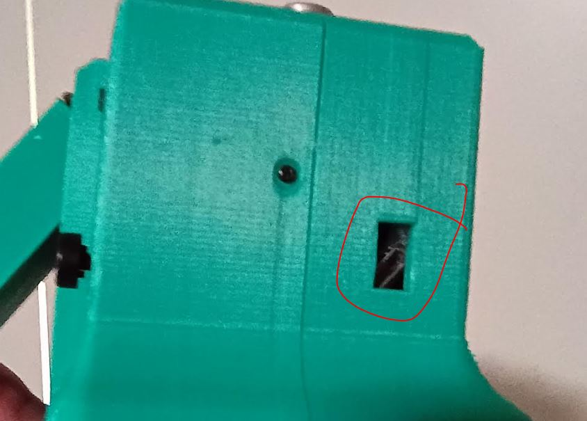
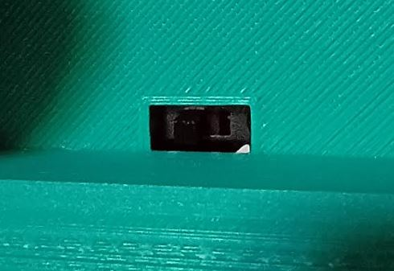
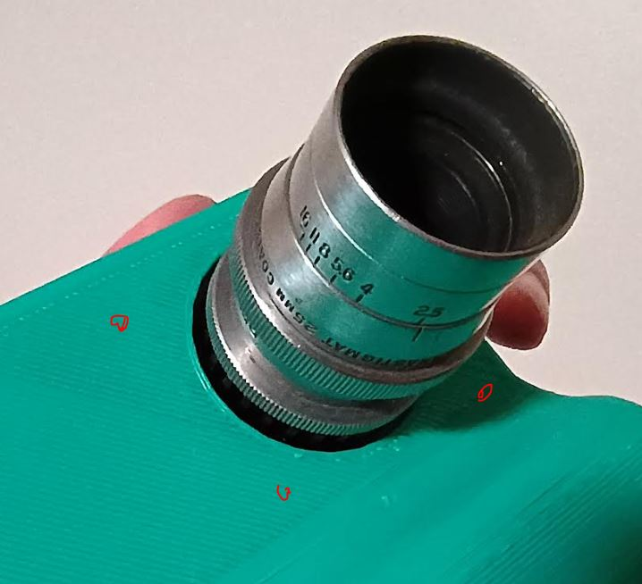

### General notes

The surface finish is from choice, if you print it the other way it takes a lot longer but you'll get a nice smooth finish vs. where support was detached.

### External design flaws

- hinge gap and back button

The back button I had designed the center black part to pop out just a little bit, while the outer part (tiny black dots) were underneath a thin piece of plastic, this was a mistake, as the smaller outer dots are almost are pretty tall... I ended up just having to take a soldering iron and roughly cutting out a square and hot-gluing it in place.

The hinges should have been pout out to the side more, I didn't realize how big of a gap that is in the middle, in that case you'd just drop the ceiling. The top of the LCD lid flips away so the ceiling can just be pulled straight down.

Although not shown here, the bottom of the display presses tightly into the body through compression not by design, it was lucky.

I would also put fixed/rotated slats/angles so the display can open at certain angles and not flop around like it does now based on gravity.

- OLED hole is too big (fixed in 3D model)

You can see in red the size of the gap. The Pi 4B actually runs pretty warm so when I filled that in, I added a ramp shape so it can still let air out, since there aren't any directly-designed air flow holes.

### Internal design flaws

- charging board

This is an external video but you can see the result I have. The problem is this board gets hot while the battery charges. So it will unmelt hotglue. I didn't design a good support for it internally.

- switch

This is another external photo but inside, the screw mounts were too small, I ended up just hot-gluing the switch the body.

The other problem is it's not that easy to get access to the switch, I use the tip of my finger. I was aware of this while designing it but I was focused on making the switch hidden.

- HQ cam screw mounts

So I think what happened here is I used Arducam's IMX477 board measurements so the holes are off. If they do match then nvm but I believe I pulled a model I made around that board from the ML Hat Cam. Anyway the screw mounts didn't line up and I also ended up hot-gluing the sensor to the camera body. Which is not a bad thing considering how many random lenses/big lenses I attach to this camera.
