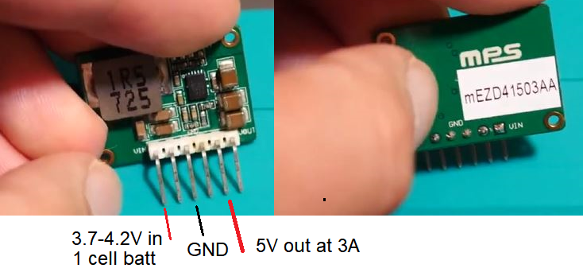

### Hardware

See the [parts list](./PARTS_LIST.md) for itemized breakdown of parts and cost.

#### Please note:

The tiny OLED on top eg. 0.91" OLED requires a 3A DC-DC boost converter to work (along with the rest of the system).

The cheap 2A DC-DC boost converter will not cut it (results in the 0.91" display being scrambled on boot).

Either don't use it, or use it and get a more expensive power supply like this one: (`$15` each vs. `$0.70` each eg. 2A)

